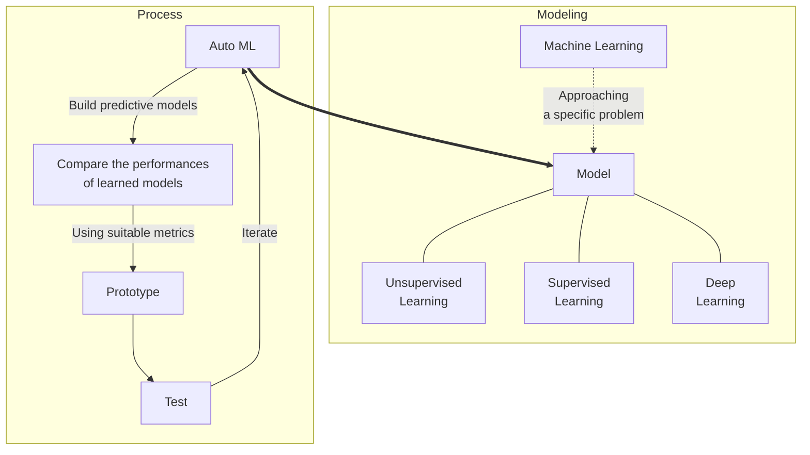

[TOC]

## (190702)Confirmed by Kusunoki sensei

**Title: Application of deep learning in predictions of the minimum number of sensors and the optimal locations of sensors for structural health monitoring (SHM)**

**[Introduction]**

As repairing and enhancing existing reinforced concrete structures have taken place in the field of structural engineering, monitoring the performance and structural integrity of structures has been recognized as a high priority. 

Thus, reinforced concrete structures usually require as many sensors as possible to monitor their health condition to assure the safety of structures.

However, it is not easy to estimate:

1. how many arrays of connected sensors are required and where to install the sensors
2. how to track the locations of damages using the optimal number of sensors
3. how to assess the condition of structures 
   In the research, deep learning will be introduced as a good candidate to analyze three issues above. 

**[Creating  Datasets for deep learning model and validation model]**

In the research, two types of datasets will be prepared: 

1. Dataset from E-Defense test

2. Dataset from non-destructive and destructive test data from existing structures 

Since E-Defense has gained popularity in recent years among researchers all over the world, sensor data from E-Defense test results will be used as a dataset for deep learning. 

For the validation, non-destructive and destructive test data from existing structures will be used to ensure the model is generalizable. 

Therefore, it can be found out that how well the model based on E-Defense estimate the most severe possible damages.

**[Building a Model]**

In the research, three deep learning models will be introduced:

1. Model for the optimal number of sensors and location of sensors
2. Model for tracking the locations of damages using supervised learning (Classification)
3. Model for assessing the condition of structures using unsupervised learning (Clustering)
   Since E-Defense provides precise load combinations, accelerometer, displacement meter data, Convolution neural network (CNN) will be used to figure out three models above.

**[Solution]**
As a result of the research, a new SHM process for existing structures will be proposed to reduce maintenance costs and increase the lifetime of structures.

## Research plan(deprecated)

### Title: Application of machine learning in predictions of the minimum number of sensors and the optimal locations of sensors for structural health monitoring

As repairing and enhancing existing reinforced concrete structures have taken place in the field of structural engineering, monitoring the performance and structural integrity of structures has been recognized as a high priority. With this manner, structural health monitoring (SHM) with sensors has become an essential part of the field of structural engineering. 

Thus, reinforced concrete structures usually require as many sensors as possible to monitor their health condition to assure the safety of structures.

However, it is not easy to estimate how many arrays of connected sensors are required and where to install the sensors due to the complexity of structures' design and maintenance cost of the SHM system.

Therefore, in my research, I will implement a neural network to make predictions of the minimum number of sensors and the optimal locations of sensors in a cost-effective manner.

[Creating a Dataset]

At first, I will focus on non-destructive and destructive tests from extracted beams to figure out the most severe possible damages based on locations of test points. Then I will build a classification system that can help flag serious cases of failures.

[Building a Model]

And I will build a neural network to carry out predictions on the structural dataset from destructive and non-destructive tests and evaluate the results of a model using automated machine learning. Then, I will implement the model with different variants of the structural data to evaluate how the data affects performance of structures. In this step, sensors location and the number of sensors will be discussed as a result of the model.

[Measuring Impact and Updating Models]

For the integrity of the model, post-deployment impact of sensors location and the number of sensors will be evaluated. I will update the model to avoid unwanted bias, ensure security, and compliance to develop the business cases.

My research would take advantage of reducing maintenance costs and increasing the lifetime of structures.

### AI Product Manager

https://d20vrrgs8k4bvw.cloudfront.net/documents/en-US/AI+Product+Manager+Nanodegree+Program+Syllabus.pdf

**01 Introduction to AI in Business**
Gain foundational knowledge of AI and machine learning, how to develop a business case for an AI application, and how and when to use AI in a product.

**02 Creating a Dataset**
A high-quality training data set is essential for machine learning models. Learn how to create a high-quality dataset, including how well the data fits a particular use case.

<u>Create a Medical Image Annotation Data Set with Figure Eight</u>

In this project, you will create an annotated training data set on Figure Eight’s platform. You’ll build a classification system that can help flag serious cases of pneumonia.

**03 Building a Model**
Learn how a neural network produces a decision and how “training” works. You’ll also learn how to use training data and how to evaluate the results of a model.

<u>Build a Model with Google AutoML</u>

Build models using automated machine learning, from data to results with no coding required. You’ll implement your model with four different variants of data to evaluate how the data affects performance.

**04 Measuring Impact and Updating Models**
Learn how to measure post-deployment impact, and how to make data-informed improvements on your model. You’ll also learn how to avoid unwanted bias, ensure security and compliance, and how to scale your product.

<u>Capstone Project</u>

Develop a business proposal for an AI product for a use case of your choosing. You’ll develop the business case, define success metrics, scope the dataset and build a post-deployment monitoring plan.

### Sensor Fusion Engineer

https://d20vrrgs8k4bvw.cloudfront.net/documents/en-US/Sensor+Fusion+Engineer+Nanodegree+Syllabus.pdf

Learn to fuse data from three of the primary sensors that robots use: lidar, camera, and radar.

**01 Lidar**

Process raw lidar data with filtering, segmentation, and clustering to detect other vehicles on the road.

<u>Lidar Obstacle Detection</u>

Detect other cars on the road using raw lidar data from Udacity’s real self-driving car, Carla! Implement custom ransac and euclidean clustering algorithms.

**02 Radar**

Analyze radar signatures to detect and track objects. Calculate velocity and orientation by correcting for radial velocity distortions, noise, and occlusions.

<u>Radar Obstacle Detection</u>

Calibrate, threshold, and filter radar data to detect obstacles in real radar data.

**03 Cameras**

Fuse camera images together with lidar point cloud data. You'll extract object features, classify objects, and project the camera image into three dimensions to fuse with lidar data.

<u>Camera and Lidar Fusion</u>

Detect and track objects from the benchmark KITTI dataset. Classify those objects and project them into three dimensions. Fuse those projections together with lidar data to create 3D objects to track over time.

**04 Kalman Filters**

Fuse data from multiple sources using Kalman filters, and build extended and unscented Kalman filters for tracking nonlinear movement.

<u>Unscented Kalman Filters</u>

Put your skills to the test! Code an Unscented Kalman Filter in C++ to track highly non-linear pedestrian and bicycle motion.

### 브레인스토밍

Data 수집 ➔ Numerical simuation ➔ 센서 최적수량 및 위치

01) Data 수집

- Bending, sheer, and torsion에 의해서 가장 많이 영향받는 부분을 찾는다
- [NDT 및 DT 수행논문을 찾는다][02] possible damage를 찾기위한 목적임
  - Non-destructive (rebound number and ultrasonic velocity) and destructive (cores) tests
  - Extracted beam
  - 각 specimen의 Location of test points를 기준으로 찾는다

02) Numerical simulation

- ML/DL 을 통해 찾는다
- [이 부분에 wavelet CNN 들어감][01]
- Statistical analysis를 활용함

03) 센서의 수량과 위치를 결정

나중에 검증은 defense test를 통해서 가능함

- 일단 센서의 위치와 최소수량을 예측하고
- 실제 실험 후 결과와 비교해보면 됨 
- 그러면 이게 잘 맞는 모델인지 알수 있음

## Study

### Fantilli 교수논문

Assessment of concrete strength

- design retrofits and/or
- conservation(보호) of existing reinforced concrete structure

Destructive test

Using cores extracted from structural elements which requires

This can be applied to 센서의 위치 및 수량의 결정

### 쿠수노기 센세이 논문

Curve decomposition: 커브의 분해

## 

[01] Fantilli 교수 논문

[03]: 쿠수노기 센세이 논문

[02]: [웨이브릿 변환](https://terms.naver.com/entry.nhn?docId=3338565&cid=42346&categoryId=42346)

04 [Wavelet transform](https://en.wikipedia.org/wiki/Wavelet_transform)

05 [Wavelet Convolutional Neural Networks](<https://arxiv.org/abs/1805.08620>)

## Resources

**01** Seismic Health Monitoring of a Space Reinforced Concrete Frame Structure Using Piezoceramic-Based Sensors

[https://ascelibrary.org/doi/full/10.1061/%28ASCE%29AS.1943-5525.0000999](https://ascelibrary.org/doi/full/10.1061/(ASCE)AS.1943-5525.0000999)

**02** Current Challenges for Structural Health Monitoring Systems

<https://www.sensuron.com/industry-news/structural-health-monitoring-systems/>

**03** Why We Need Structural Health Monitoring?

<https://www.fprimec.com/why-we-need-structural-health-monitoring/>

**04** Introduction to Structural Health Monitoring

<http://www.iste.co.uk/data/doc_xqjujdlhnfls.pdf>

**05** Structural health monitoring

<https://en.wikipedia.org/wiki/Structural_health_monitoring>

**06** Architectural design values

<https://en.wikipedia.org/wiki/Architectural_design_values>

**07** Finding the sensors location and the number of sensors in sensor networks with a genetic algorithm

https://ieeexplore.ieee.org/document/4772651

**08** What is Machine Learning?

https://heartbeat.fritz.ai/what-is-machine-learning-fd7e4dd24479

## References

[01]: https://arxiv.org/abs/1805.08620	"Wavelet Convolutional Neural Networks"
[02]: https://www.sciencedirect.com/science/article/pii/S095006181300500X "An experimental study on the within-member variability of in situ concrete strength in RC building structures"